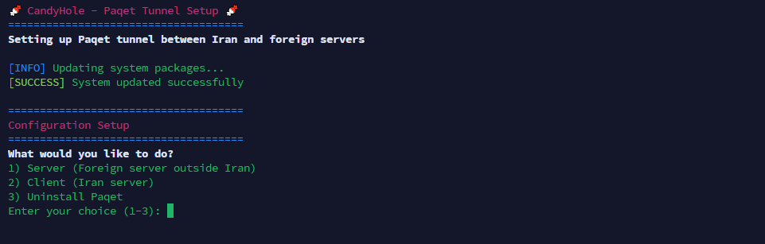

# 🍬 CandyHole - Paqet Tunnel Setup

[](README.md)
[](fa-readme.md)

A user-friendly script to set up Paqet tunnels between Iran and foreign servers, helping bypass internet censorship.

## Quick Start

### Option 1: Direct Download and Run

Download and run the script directly from GitHub:

```bash
# Download the script
wget https://raw.githubusercontent.com/AmiRCandy/CandyHole/main/CandyHole.sh


# Make it executable (Linux/Unix systems)
chmod +x CandyHole.sh

# Run as root
sudo ./CandyHole.sh
```

### Option 2: Run Directly with curl

Or run directly without downloading:

```bash
sudo bash -c "$(curl -fsSL https://raw.githubusercontent.com/AmiRCandy/CandyHole/main/CandyHole.sh)"
```

## Screenshot



## Features

- 🎨 **Colored Interface**: Beautiful, easy-to-read colored output
- ✅ **Input Validation**: Validates IP addresses, ports, and user inputs
- 🔧 **Automatic Configuration**: Generates proper YAML configs for both client and server
- 🛡️ **Firewall Setup**: Automatically configures iptables and UFW
- 🔄 **System Service**: Creates and manages systemd service for Paqet
- 📝 **Error Handling**: Comprehensive error checking and recovery
- 📊 **Progress Indicators**: Shows progress during setup

## Prerequisites

- Ubuntu/Debian-based Linux system
- Root access (run with `sudo`)
- Internet connection

## Usage

Download and run the script:

```bash
wget https://raw.githubusercontent.com/AmiRCandy/CandyHole/main/CandyHole.sh
chmod +x CandyHole.sh
sudo ./CandyHole.sh
```

Or run directly:
```bash
sudo bash -c "$(curl -fsSL https://raw.githubusercontent.com/AmiRCandy/CandyHole/main/CandyHole.sh)"
```

### Server Setup (Foreign Server)

1. Choose option "1) Server (Foreign server outside Iran)"
2. Enter your desired port (default: 8080)
3. The script will automatically:
   - Install Paqet and dependencies
   - Generate a secret key
   - Configure network settings
   - Set up firewall rules
   - Create systemd service
   - Start the tunnel

**Save the generated information:**
- Server IP
- Server Port
- Secret Key

### Client Setup (Iran Server)

1. Choose option "2) Client (Iran server)"
2. Enter the foreign server IP address
3. Enter the server port
4. Enter the secret key from server setup
5. The script will automatically configure everything

### Uninstall

To completely remove Paqet and all its components:

1. Choose option "3) Uninstall Paqet"
2. The script will automatically:
   - Stop and remove the Paqet service
   - Remove configuration files
   - Remove Paqet binary
   - Clean up firewall rules
   - Optionally remove installed system packages

## What It Does

### For Server:
- Installs Paqet tunneling software
- Generates unique secret key
- Creates server configuration with detected network settings
- Sets up firewall rules
- Creates systemd service for auto-start
- Provides SOCKS5 proxy at `127.0.0.1:1404`

### For Client:
- Installs Paqet tunneling software
- Creates client configuration connecting to your server
- Sets up firewall rules
- Creates systemd service for auto-start
- Provides tunnel to bypass censorship

## Configuration Files

- **Server**: `/etc/paqet/server.yaml`
- **Client**: `/etc/paqet/client.yaml`
- **Service**: `/etc/systemd/system/paqet.service`

## Useful Commands

```bash
# Check service status
sudo systemctl status paqet

# View real-time logs
sudo journalctl -u paqet -f

# Restart service
sudo systemctl restart paqet

# Stop service
sudo systemctl stop paqet

# Edit configuration
sudo nano /etc/paqet/server.yaml  # or client.yaml
```

## Troubleshooting

1. **Service won't start**: Check logs with `sudo journalctl -u paqet -f`
2. **Connection issues**: Verify firewall settings and port accessibility
3. **Network detection failed**: Check `ip route` output and network configuration
4. **Permission issues**: Make sure you're running as root

## Security Notes

- The script generates a random secret key for authentication
- Firewall rules are configured to allow only necessary traffic
- SOCKS5 proxy uses default credentials (change them in config if needed)

## Advanced Configuration

After setup, you can edit the YAML configuration files to:
- Change KCP settings for better performance
- Modify logging levels
- Adjust network interface settings
- Configure additional SOCKS5 users

## Repository

- **CandyHole Repository**: [https://github.com/AmiRCandy/CandyHole](https://github.com/AmiRCandy/CandyHole)
- **Direct Script URL**: [https://raw.githubusercontent.com/AmiRCandy/CandyHole/master/CandyHole.sh](https://raw.githubusercontent.com/AmiRCandy/CandyHole/main/CandyHole.sh)

## Support

- **CandyHole Issues**: Create an issue in the [CandyHole repository](https://github.com/AmiRCandy/CandyHole)
- **Paqet Issues**: Check the [official Paqet repository](https://github.com/hanselime/paqet)

# Thanks to
- [**LlamaStudioCommunity**](https://t.me/LlamaStudioCommunity)

---

**Happy tunneling! 🌐**


